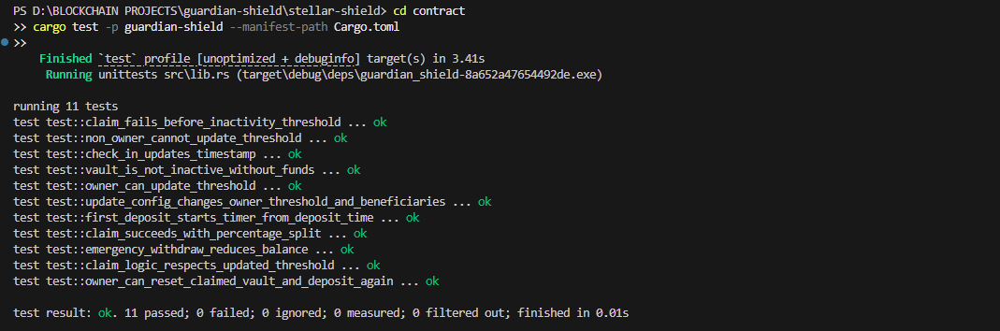

# ??? Guardian Shield - Soroban Crypto Inheritance Vault


Guardian Shield is a decentralized inheritance dApp on Stellar Soroban. The owner deposits funds and checks in periodically. If inactivity exceeds the threshold, beneficiaries can claim based on configured percentage splits.

---

## ?? Live Links

- ?? **Live App (Vercel):** https://guardian-sheild.vercel.app/
- ?? **Demo Video (1 min):** https://youtu.be/UBJtXyQNLoU

---

## ?? About the Project

### Owner Flow
1. Connect wallet
2. Initialize vault configuration
3. Deposit funds
4. Check in periodically
5. Update threshold / beneficiaries
6. Reset vault after claim

### Beneficiary Flow
1. Connect wallet
2. View vault status and timeline
3. Claim when inactivity threshold is reached

### Core Behavior
- Timer is armed only when vault has funds.
- First deposit from zero starts the timer context.
- Claim is blocked if vault is empty or already claimed.

---

## ?? Tech Stack

- **Frontend:** Next.js 16, TypeScript, Tailwind CSS, React Query
- **Smart Contract:** Rust + `soroban-sdk`
- **Wallet & Tx:** `@stellar/freighter-api`, `@stellar/stellar-sdk`
- **Bot Automation:** Railway worker (`scripts/guardian-claim-bot.mjs`)

---

## ?? Smart Contract API

- `init(owner, beneficiaries, threshold_seconds)`
- `deposit(amount)`
- `check_in()`
- `claim_if_inactive()`
- `set_threshold(new_threshold)`
- `get_threshold()`
- `update_config(new_owner, beneficiaries, threshold_seconds)`
- `emergency_withdraw(amount)`
- `reset_vault()`
- `get_status()`
- `get_activity_logs()`

---

## ?? Project Structure

```text
app/                            Next.js app router pages and API routes
components/                     Dashboard UI components
services/stellar.ts             Soroban service layer used by frontend
scripts/guardian-claim-bot.mjs  Railway auto-claim bot (polling)
contract/contracts/guardian-shield/src/lib.rs   Main contract
contract/contracts/guardian-shield/src/test.rs  Contract tests
```

---

## ?? Local Setup

### 1) Install dependencies
```bash
npm install
```

### 2) Configure `.env.local`
```env
NEXT_PUBLIC_SOROBAN_RPC_URL=https://soroban-testnet.stellar.org
NEXT_PUBLIC_GUARDIAN_CONTRACT_ID=<DEPLOYED_CONTRACT_ID>
NEXT_PUBLIC_NETWORK_PASSPHRASE=Test SDF Network ; September 2015
NEXT_PUBLIC_GUARDIAN_SOURCE_PUBLIC_KEY=<PUBLIC_G_ADDRESS_FOR_READS>
```

> Never put secret keys in any `NEXT_PUBLIC_*` variable.

### 3) Run frontend
```bash
npm run dev
```

---

## ??? Contract Build & Deploy

From `contract/`:

```bash
stellar contract build
stellar contract deploy --wasm target/wasm32v1-none/release/guardian_shield.wasm --source <identity> --network testnet
```

Initialize:

```bash
stellar contract invoke --id <CONTRACT_ID> --source <owner_identity> --network testnet -- init --owner <OWNER_G_ADDRESS> --beneficiaries-file-path beneficiaries.json --threshold_seconds 120
```

Verify:

```bash
stellar contract invoke --id <CONTRACT_ID> --source <owner_identity> --network testnet -- get_status
```

---

## ? Testing

Run tests:

```bash
cd contract
cargo test -p guardian-shield --manifest-path Cargo.toml
```

Current result: **11 passed, 0 failed**.



---

## ?? Railway Bot (Auto Claim)

Use Railway to run auto-claim continuously.

### Required Railway Environment Variables
- `SOROBAN_RPC_URL`
- `GUARDIAN_CONTRACT_ID`
- `NETWORK_PASSPHRASE`
- `CLAIM_BOT_SECRET_KEY`
- `CLAIM_BOT_POLL_MS`
- optional: `CLAIM_BOT_FINALITY_TIMEOUT_MS`

### Railway Commands
- **Build:** `npm install`
- **Start:** `node scripts/guardian-claim-bot.mjs`

Expected logs:
- `Bot started for contract ...`
- `Vault still active ...`
- `Vault inactive. Triggering claim ...`
- `Claim succeeded. tx=...`

---

## ?? Deployment

### Vercel (Frontend)
Set these env vars in Vercel:
- `NEXT_PUBLIC_SOROBAN_RPC_URL`
- `NEXT_PUBLIC_GUARDIAN_CONTRACT_ID`
- `NEXT_PUBLIC_NETWORK_PASSPHRASE`
- `NEXT_PUBLIC_GUARDIAN_SOURCE_PUBLIC_KEY`

### Railway (Bot)
Set bot vars listed above and run with:
- `node scripts/guardian-claim-bot.mjs`

---

## ?? Security Notes

- Never commit `.env.local`.
- Never expose `S...` secret keys in public env.
- Rotate keys if leaked.
- Keep signing in Freighter for user-initiated transactions.

---

## ?? Troubleshooting

- **Dashboard stuck on loading**
  - Check contract ID, RPC URL, and `NEXT_PUBLIC_GUARDIAN_SOURCE_PUBLIC_KEY`.
  - Restart dev server after env changes.

- **Transaction rejected by RPC**
  - Ensure connected wallet is owner for owner-only calls.
  - Ensure vault is initialized and not already claimed.

- **Beneficiary update fails**
  - Ensure percentages total exactly 100.
  - Avoid duplicate beneficiary addresses.
